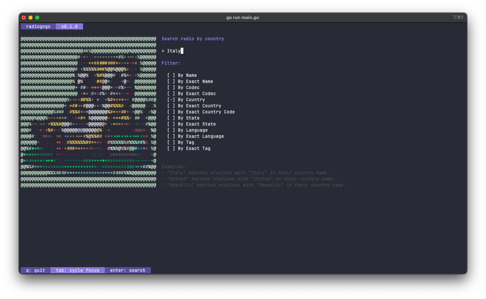
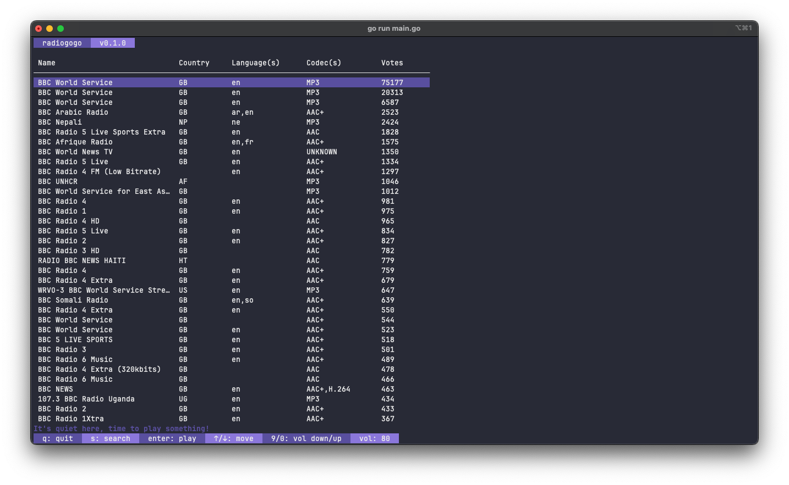

# RadioGoGo 📻

<div style="display:flex;justify-content:center;">
    
</div>
<br>

Tune into global radio vibes directly from your terminal! 

Crafted with love in Go, RadioGoGo marries the elegance of the [BubbleTea TUI](https://github.com/charmbracelet/bubbletea) with the expansive reach of [RadioBrowser API](http://www.radio-browser.info/). 

Dive into a world of sounds with just a few keystrokes. 

Let's Go 🚀!



## ⭐️ Features

- Sleek and intuitive TUI that's a joy to navigate.
- Search, browse, and play radio stations from a vast global database.
- Enjoy cross-platform compatibility, because radio waves know no bounds.
- Integrated playback using `ffplay`.

## 📋 Upcoming Features

- Bookmark your favorite stations for easy access.
- Record your favorite broadcasts for later listening.
- Integrated playback using `mpv`.

## ⚒️ Installation

### Dependencies: Installing FFmpeg

For seamless playback, ensure `ffplay` is installed:

#### Windows:

Download FFmpeg from the [official website](https://ffmpeg.org/download.html) and add it to your system's PATH.

It can also be installed via [Chocolatey](https://chocolatey.org/) or [Scoop](https://scoop.sh/).


#### Linux:

##### For apt-based distros (like Ubuntu and Debian):

```bash
sudo apt update
sudo apt install ffmpeg
```

##### For dnf-based distros (like Fedora):

```bash
sudo dnf install ffmpeg
```

##### For pacman-based distros (like Arch):

```bash
sudo pacman -S ffmpeg
```

##### For Gentoo:

```bash
emerge --ask --quiet --verbose media-video/ffmpeg
```

#### macOS:

```bash
brew install ffmpeg
```

#### FreeBSD:

```bash
pkg install ffmpeg
```

#### NetBSD:

```bash
pkg_add ffmpeg
```

#### OpenBSD:

```bash
doas pkg_add ffmpeg
```

### Terminals for an optimal RadioGoGo experience:

- **Windows:** For a smooth experience on Windows, consider using [Windows Terminal](https://aka.ms/terminal). It offers multiple tabs, a GPU-accelerated text rendering engine, and a rich set of customization options. If you're fond of UNIX-like environments, [WSL (Windows Subsystem for Linux)](https://docs.microsoft.com/en-us/windows/wsl/) combined with Windows Terminal can be a powerful duo.

- **Linux:** On Linux, most modern terminals should work well with BubbleTea. However, [Alacritty](https://github.com/alacritty/alacritty), a GPU-accelerated terminal, and [Terminator](https://gnometerminator.blogspot.com/p/introduction.html), known for its flexibility, stand out as exceptional choices. Both offer great performance and customization options to enhance your TUI experience.

- **macOS:** On macOS, while the default Terminal.app should work fine, you might want to explore [iTerm2](https://iterm2.com/) for its advanced features, superior performance, and extensive customization options. iTerm2's integration with macOS makes it a preferred choice for many developers.

### Installing via Go

Ensure you have [Go](https://golang.org/dl/) installed (version 1.18 or later).

```bash
go install github.com/Zi0P4tch0/RadioGoGo@latest
```

### Downloading the Binary

Navigate to the `Releases` section of the project repository. 

Find the appropriate binary for your OS, download it, and place it in your system's PATH for easy access.

## 🚀 Usage

Launch RadioGoGo by executing the following command:

```bash
radiogogo
```

## ❤️ Contributing

Hey there, fellow radio enthusiast! 

First off, a big thanks for even considering contributing. 

Every typo fix, bug report, or thought you share genuinely helps make RadioGoGo better. If you're eyeing to introduce a new feature, I'd love to hear about it! 

Please kick off a discussion by creating an issue before diving into crafting a pull request. This way, we can ensure everyone's on the same frequency. 

📻 Happy coding!


## ⚖️ License(s)

RadioGoGo is licensed under the [MIT License](LICENSE).

### Third-party dependencies

BubbleTea TUI license (MIT):

```
MIT License

Copyright (c) 2020-2023 Charmbracelet, Inc

Permission is hereby granted, free of charge, to any person obtaining a copy
of this software and associated documentation files (the "Software"), to deal
in the Software without restriction, including without limitation the rights
to use, copy, modify, merge, publish, distribute, sublicense, and/or sell
copies of the Software, and to permit persons to whom the Software is
furnished to do so, subject to the following conditions:

The above copyright notice and this permission notice shall be included in all
copies or substantial portions of the Software.

THE SOFTWARE IS PROVIDED "AS IS", WITHOUT WARRANTY OF ANY KIND, EXPRESS OR
IMPLIED, INCLUDING BUT NOT LIMITED TO THE WARRANTIES OF MERCHANTABILITY,
FITNESS FOR A PARTICULAR PURPOSE AND NONINFRINGEMENT. IN NO EVENT SHALL THE
AUTHORS OR COPYRIGHT HOLDERS BE LIABLE FOR ANY CLAIM, DAMAGES OR OTHER
LIABILITY, WHETHER IN AN ACTION OF CONTRACT, TORT OR OTHERWISE, ARISING FROM,
OUT OF OR IN CONNECTION WITH THE SOFTWARE OR THE USE OR OTHER DEALINGS IN THE
SOFTWARE.
```
