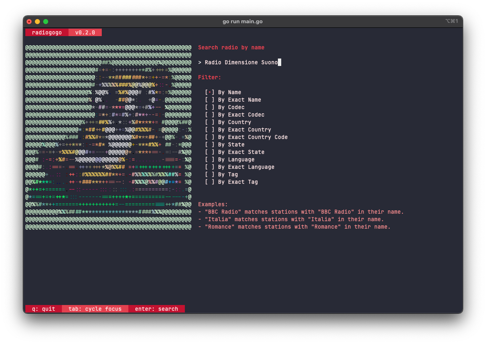
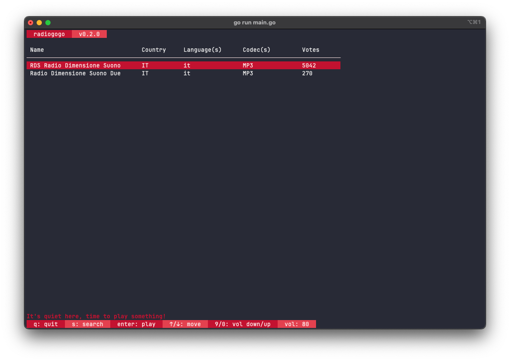

# RadioGoGo 📻

<div style="display:flex;justify-content:center;">
    
</div>
<br>

Tune into global radio vibes directly from your terminal! 

Crafted with love in Go, RadioGoGo marries the elegance of the [BubbleTea TUI](https://github.com/charmbracelet/bubbletea) with the expansive reach of [RadioBrowser API](http://www.radio-browser.info/). 

Dive into a world of sounds with just a few keystrokes. 

Let's Go 🚀!


## ⭐️ Features

- Sleek and intuitive TUI that's a joy to navigate.
- Search, browse, and play radio stations from a vast global database.
- Enjoy cross-platform compatibility, because radio waves know no bounds.
- Integrated playback using `ffplay`.

## 📋 Upcoming Features

- Scroll indicator for the station list.
- Report / hide broken stations.
- Vote stations.
- Bookmark your favorite stations for easy access.
- Record your favorite broadcasts for later listening.

## ⚒️ Installation

### Dependencies: 

For seamless playback, ensure you have either `ffplay` installed:

#### FFmpeg

##### Windows:

Download FFmpeg from the [official website](https://ffmpeg.org/download.html) and add it to your system's PATH. For those unfamiliar with adding to the PATH, you might want to consult a guide or search for instructions specific to your version of Windows.

It can be installed via [Chocolatey](https://chocolatey.org/):

```
choco install ffmpeg
```

Or [Scoop](https://scoop.sh/):

```
scoop install ffmpeg
```

##### Linux:

For apt-based distros (like Ubuntu and Debian):

```
sudo apt update
sudo apt install ffmpeg
```

For users of dnf-based distros such as Fedora, you may need to enable the RPM Fusion repository first before installing FFmpeg:

```
sudo dnf install https://download1.rpmfusion.org/free/fedora/rpmfusion-free-release-$(rpm -E %fedora).noarch.rpm https://download1.rpmfusion.org/nonfree/fedora/rpmfusion-nonfree-release-$(rpm -E %fedora).noarch.rpm
```

And then:

```
sudo dnf install ffmpeg
```

For pacman-based distros, such as Arch, you can install FFmpeg using the following command:

```
sudo pacman -S ffmpeg
```

For Gentoo:

```
emerge --ask --quiet --verbose media-video/ffmpeg
```

##### macOS:

For macOS users with Homebrew installed, you can use the following command:

```
brew install ffmpeg
```

##### \*BSD:

FreeBSD:

```
pkg install ffmpeg
```

NetBSD:

```
pkg_add ffmpeg
```

OpenBSD:

```
doas pkg_add ffmpeg
```

### Installing via Go

Ensure you have [Go](https://golang.org/dl/) installed (version 1.18 or later).

To install RadioGoGo:

```bash
go install github.com/zi0p4tch0/radiogogo@latest
```

#### For Linux/macOS/\*BSD:

To make sure `radiogogo` is available in your terminal, you might need to add the Go binary path to your system's PATH:

```bash
export PATH=$PATH:$(go env GOPATH)/bin
```

#### For Windows:

After installation, you might need to add the Go binary path to your system's PATH to run `radiogogo` from the Command Prompt. You can do this manually through the System Properties → Environment Variables, or run the following in Command Prompt:

```bash
setx PATH "%PATH%;%USERPROFILE%\go\bin"
```

Now, you can launch `radiogogo` directly from your terminal or Command Prompt.

### Downloading the Binary

Navigate to the `Releases` section of the project repository. 

Find the appropriate binary for your OS, download it, and place it in your system's PATH for easy access.

## 🚀 Usage

Launch RadioGoGo by executing the following command:

```bash
radiogogo
```

### Terminals for an optimal RadioGoGo experience:

- **Windows:** For a smooth experience on Windows, consider using [Windows Terminal](https://aka.ms/terminal). It offers multiple tabs, a GPU-accelerated text rendering engine, and a rich set of customization options. If you're fond of UNIX-like environments, [WSL (Windows Subsystem for Linux)](https://docs.microsoft.com/en-us/windows/wsl/) combined with Windows Terminal can be a powerful duo.

- **Linux:** On Linux, most modern terminals should work well with RadioGoGo. However, [Alacritty](https://github.com/alacritty/alacritty), a GPU-accelerated terminal, and [Terminator](https://gnometerminator.blogspot.com/p/introduction.html), known for its flexibility, stand out as exceptional choices. Both offer great performance and customization options to enhance your TUI experience.

- **macOS:** On macOS, while the default Terminal.app should work fine, you might want to explore [iTerm2](https://iterm2.com/) for its advanced features, superior performance, and extensive customization options. iTerm2's integration with macOS makes it a preferred choice for many users.

## Configuration

**Config File Location:**
- **Windows:** `%LOCALAPPDATA%\radiogogo\config.yaml`
- **Other Platforms:** `~/.config/radiogogo/config.yaml`

It gets created automatically when you launch the app for the first time.

### 🎨 Customizing App Theme

Personalize the look of RadioGoGo to match your style! 

The application supports theme customization, which allows you to change various color attributes to give the TUI a fresh appearance.

The configuration file is automatically created when the app is launched for the first time if it doesn't already exist.

**Default Theme Configuration:**
```yaml
theme:
    textColor: '#ffffff'
    primaryColor: '#5a4f9f'
    secondaryColor: '#8b77db'
    tertiaryColor: '#4e4e4e'
    errorColor: '#ff0000'
```

Adjust the color values in the configuration to your liking and relaunch the app to see the changes take effect.

Here's another theme configuration to give you an idea of how you can customize the app's appearance:

```yaml
theme:
    textColor: '#f0e6e6'
    primaryColor: '#c41230'
    secondaryColor: '#e4414f'
    tertiaryColor: '#f58b8d'
    errorColor: '#ff0000'
```

How it looks:




## 🤔 FAQ

### I selected a radio station but there's no audio. What's happening?
Upon selecting a station, the duration to initiate playback can vary based on the stream's origin and its server location.
In some cases, the playback is immediate, while in others, it might necessitate a brief buffering period. 
It's analogous to the latency encountered with various online services – certain connections are swift, while others require a momentary lag. 
If you don't experience instant audio, I recommend waiting a few seconds. 
The broadcast is likely en route to your terminal.

### Why do some stations not work at all?
Due to the dynamic nature of radio stations, some might go offline or change their streaming endpoints. 
Currently, RadioGoGo doesn't have a feature to report or hide these non-functioning stations. 
However, I am actively aware of this challenge and am planning to introduce a feature in future releases to enhance this aspect of the user experience. 

### How do I adjust the volume in RadioGoGo?
Volume controls in RadioGoGo are set before initiating playback. This is because the volume level is passed as a command line argument to `ffplay`. As of now, once the playback has started, adjusting the volume within RadioGoGo isn't supported. To change the volume during an ongoing playback, you'd have to stop (`ctrl+k`) and restart the stream.

## Who is talking about RadioGoGo?

- Mentioned on [Golang Weekly Issue 481](https://golangweekly.com/issues/481)!

## ❤️ Contributing

Hey there, fellow radio enthusiast! 

First off, a big thanks for even considering contributing. 

Every typo fix, bug report, or thought you share genuinely helps make RadioGoGo better. If you're eyeing to introduce a new feature, I'd love to hear about it! 

Please kick off a discussion by creating an issue before diving into crafting a pull request. This way, we can ensure everyone's on the same frequency. 

📻 Happy coding!


## ⚖️ License(s)

RadioGoGo is licensed under the [MIT License](LICENSE).

### Third-party dependencies

BubbleTea TUI license (MIT):

```
MIT License

Copyright (c) 2020-2023 Charmbracelet, Inc

Permission is hereby granted, free of charge, to any person obtaining a copy
of this software and associated documentation files (the "Software"), to deal
in the Software without restriction, including without limitation the rights
to use, copy, modify, merge, publish, distribute, sublicense, and/or sell
copies of the Software, and to permit persons to whom the Software is
furnished to do so, subject to the following conditions:

The above copyright notice and this permission notice shall be included in all
copies or substantial portions of the Software.

THE SOFTWARE IS PROVIDED "AS IS", WITHOUT WARRANTY OF ANY KIND, EXPRESS OR
IMPLIED, INCLUDING BUT NOT LIMITED TO THE WARRANTIES OF MERCHANTABILITY,
FITNESS FOR A PARTICULAR PURPOSE AND NONINFRINGEMENT. IN NO EVENT SHALL THE
AUTHORS OR COPYRIGHT HOLDERS BE LIABLE FOR ANY CLAIM, DAMAGES OR OTHER
LIABILITY, WHETHER IN AN ACTION OF CONTRACT, TORT OR OTHERWISE, ARISING FROM,
OUT OF OR IN CONNECTION WITH THE SOFTWARE OR THE USE OR OTHER DEALINGS IN THE
SOFTWARE.
```
